# 🏥 AI Healthcare

> **OpenAI를 활용하여 사용자의 증상을 분석하고 적절한 병원을 추천하는 <br/> AI 기반 Healthcare 서비스**


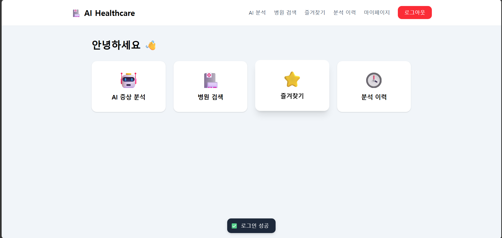

---

# 📋 프로젝트 요약

| 항목 | 내용 |
|------|------|
| 프로젝트명 | AI Healthcare |
| 개발 기간 | 2026.06 ~ 2026.07 |
| 개발 인원 | 1명 (개인 프로젝트) |
| 담당 역할 | 백엔드·프론트엔드 설계 및 구현, 외부 API 연동, Docker 기반 배포 |
| 주요 기능 | AI 증상 분석, 병원 추천, 즐겨찾기, AI 분석 이력, 마이페이지 |
| 사용 API | OpenAI API, HIRA Open API |

---

# 📌 프로젝트 소개

AI Healthcare는 사용자가 입력한 증상을 AI가 분석하여 적절한 진료과를 추천하고,
HIRA 공공데이터를 활용하여 병원 정보를 조회할 수 있는 웹 서비스입니다.

Spring Boot 기반 REST API를 직접 설계하고 React와 연동하여 서비스를 구현하였으며,
JWT 기반 로그인과 사용자별 즐겨찾기, AI 분석 이력 기능을 제공합니다.

또한 Docker Compose로 Spring Boot와 MySQL 컨테이너 환경을 구성하고,
Docker Hub에 이미지를 등록한 후 AWS EC2에서 배포 과정을 진행했습니다.

---

# 🛠 기술 스택

| 분야 | 기술 |
|------|------|
| Backend | Java 17, Spring Boot, Spring Security, Spring Data JPA, JWT |
| Frontend | React 19 |
| Database | MySQL 8 |
| Infra | Docker, Docker Compose, Docker Hub, AWS EC2 |
| External API | OpenAI API, HIRA Open API |
| Documentation | Swagger/OpenAPI |
| Build | Gradle |

---

# 🔍 기술 선택 이유

## Spring Boot

회원, 병원, 즐겨찾기, AI 분석 이력처럼 도메인이 구분된 REST API를
계층형 구조로 구현하기 위해 사용했습니다.

Spring Security, JPA 등 프로젝트에 필요한 기능을 일관된 환경에서
구성할 수 있다는 점도 고려했습니다.

## Spring Security + JWT

React와 Spring Boot가 분리된 구조에서 인증 상태를 처리하기 위해
JWT 기반 인증을 적용했습니다.

로그인 성공 시 토큰을 발급하고, 이후 요청마다 JWT 인증 필터가
토큰을 검증하도록 구성했습니다. 이를 통해 인증 로직을 각
컨트롤러에서 반복하지 않고 Spring Security 영역에서 처리했습니다.

## JPA

회원, 병원, 즐겨찾기, AI 분석 이력 간의 관계를 객체 중심으로
관리하기 위해 사용했습니다.

단순 CRUD뿐만 아니라 사용자별 즐겨찾기와 분석 이력을
연관관계로 표현하고, Repository를 통해 데이터 접근 로직을
분리했습니다.

## MySQL

회원 정보와 병원 정보, 즐겨찾기 및 분석 이력처럼 관계가 명확한
데이터를 저장해야 했기 때문에 관계형 데이터베이스를 선택했습니다.

또한 `ykiho`를 병원 식별값으로 사용하여 외부 API 데이터를
내부 데이터와 연결하고 중복 저장을 방지했습니다.

## HIRA Open API

추천한 진료과와 연결되는 실제 병원 정보를 제공하기 위해
공공데이터를 활용했습니다.

외부 API를 화면 요청마다 직접 호출하지 않고 데이터를 내부 DB에
저장한 후 검색하도록 구성하여, 검색 기능과 사용자 즐겨찾기 기능에서
동일한 병원 데이터를 사용할 수 있도록 했습니다.

## OpenAI API

사용자가 입력한 비정형 증상 문장에서 관련 진료과를 도출하기 위해
사용했습니다.

응답 결과를 그대로 화면에 출력하지 않고 필요한 항목을 파싱하여
진료과 추천과 병원 검색에 활용할 수 있는 형태로 변환했습니다.

## Docker Compose

개발 환경과 배포 환경에서 Spring Boot와 MySQL의 실행 조건을
일관되게 유지하기 위해 사용했습니다.

애플리케이션과 데이터베이스를 각각 컨테이너로 분리하고,
환경 변수와 네트워크 설정을 Docker Compose에서 관리했습니다.

---

# 🏗️ System Architecture

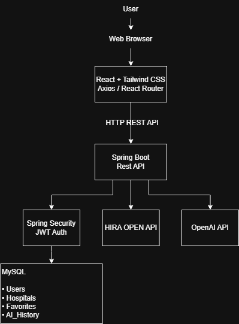

---

# 🌐 REST API

## Authentication

| Method | URL | 설명 |
|--------|-----|------|
| POST | /api/auth/signup | 회원가입 |
| POST | /api/auth/login | 로그인 |

## AI

| Method | URL | 설명 |
|--------|-----|------|
| POST | /api/ai/symptom | AI 증상 분석 |
| GET | /api/ai/histories | AI 분석 이력 조회 |
| DELETE | /api/ai/histories/{historyId} | AI 분석 이력 삭제 |

## Hospital

| Method | URL | 설명 |
|--------|-----|------|
| GET | /api/hospitals | 병원 검색 |
| GET | /api/hospitals/{id} | 병원 상세 조회 |

## Favorite

| Method | URL | 설명 |
|--------|-----|------|
| GET | /api/favorites | 즐겨찾기 조회 |
| POST | /api/favorites/{hospitalId} | 즐겨찾기 추가 |
| DELETE | /api/favorites/{hospitalId} | 즐겨찾기 삭제 |

## User

| Method | URL | 설명 |
|--------|-----|------|
| GET | /api/users/me | 내 정보 조회 |
| GET | /api/users/dashboard | 대시보드 조회 |

---

# 📂 프로젝트 구조

```text
Backend

src
└── main
    ├── java
    │    └── com.healthcare.ai_healthcare
    │         ├── ai
    │         ├── auth
    │         ├── favorite
    │         ├── history
    │         ├── hospital
    │         ├── user
    │         ├── config
    │         └── common
    └── resources

Frontend

frontend
└── src
     ├── api
     ├── components
     ├── pages
     ├── routes
     ├── hooks
     └── utils
```

---

# ✨ 주요 기능

## 👤 회원

- 회원가입
- 로그인
- JWT 기반 인증 및 인가
- Spring Security 적용

---

## 🤖 AI 증상 분석

- OpenAI API 연동
- 증상 분석
- 진료과 추천

---

## 🏥 병원 검색

- HIRA Open API 연동
- 병원 검색
- 병원 상세 조회

---

## ⭐ 사용자 기능

- 즐겨찾기
- AI 분석 이력
- 마이페이지

---

# 📊 ERD

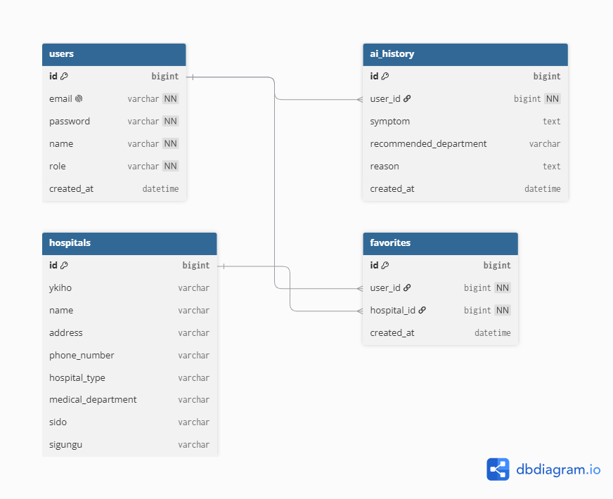

> 현재 구현에서는 HIRA 병원 기본정보 API의 한계로 `department` 컬럼을 사용하고 있습니다
>
> 향후에는 `hospitalType`과 `medicalDepartment`를 분리하고,
> HIRA 진료과목 API를 추가 연동하여 AI 추천 정확도를 향상시킬 예정입니다

---

# 🖥️ 서비스 화면

| 메인 | 로그인 |
|------|---------|
|  | 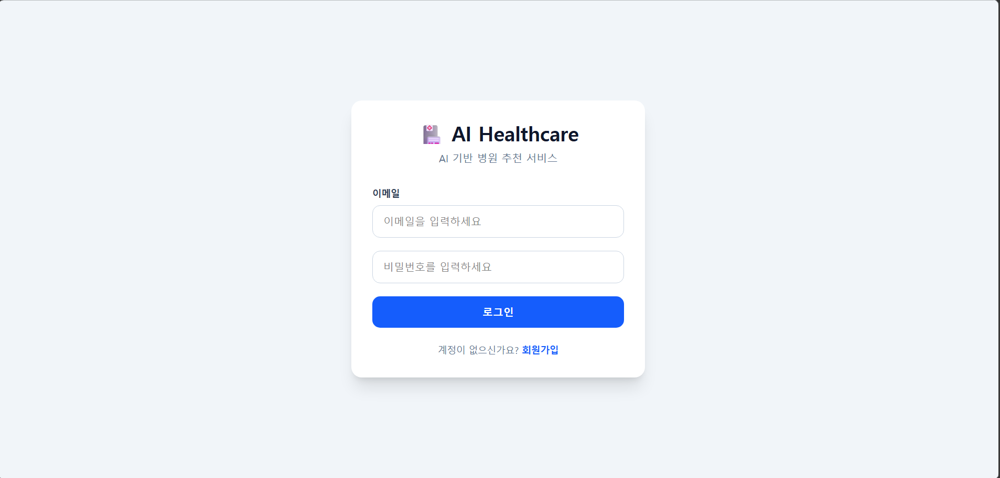 |

| AI 입력 | AI 결과 |
|---------|---------|
| 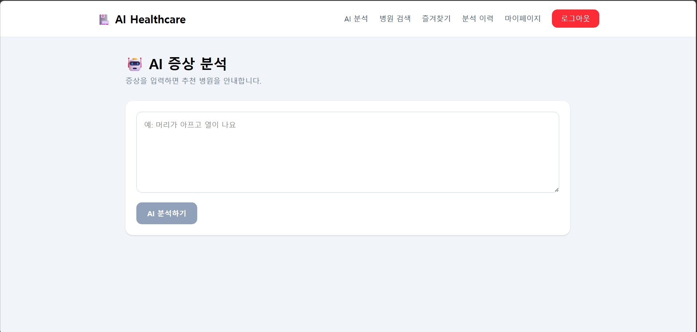 | 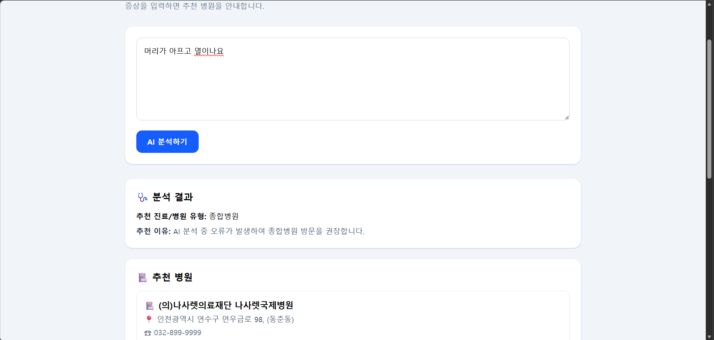 |

| 병원 검색 | 병원 상세 |
|-----------|-----------|
| 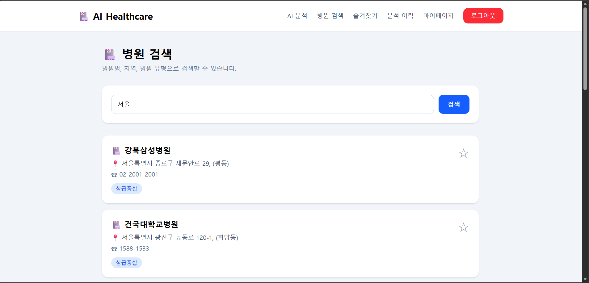 | 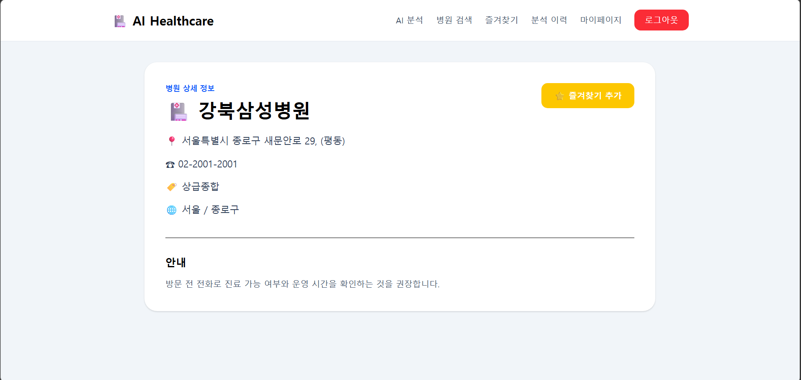 |

| 즐겨찾기 | 마이페이지 |
|-----------|-----------|
| 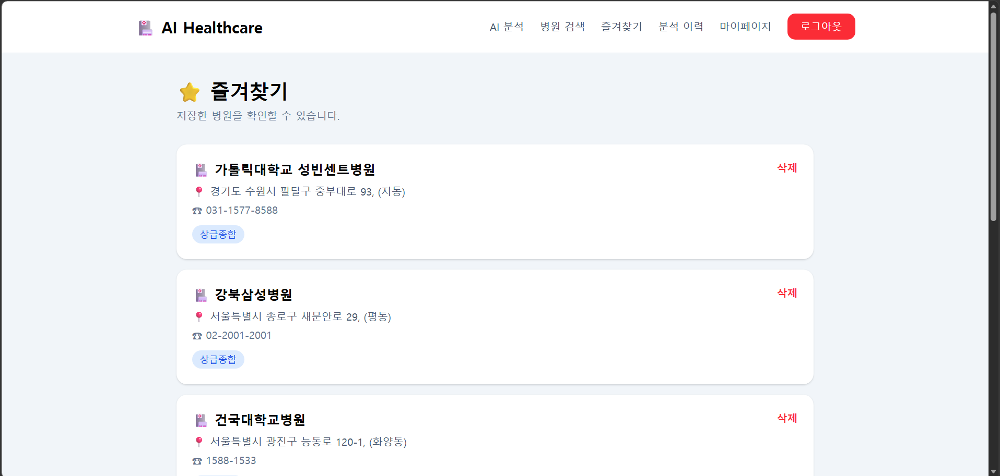 | 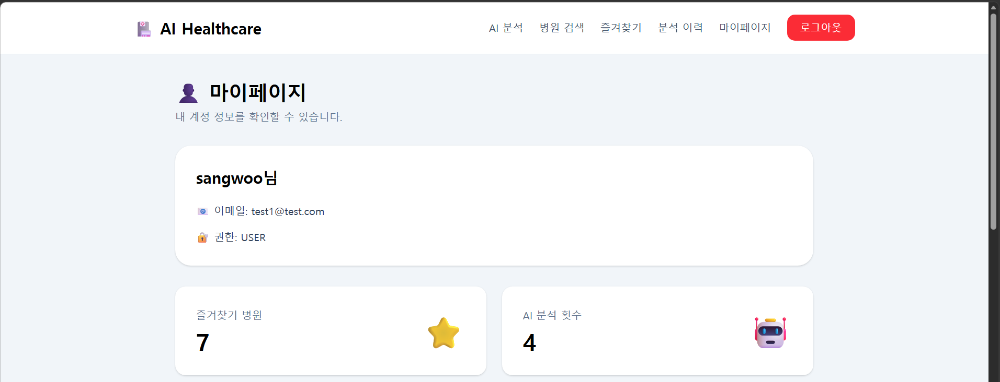 |

| 활동 통계 | AI 분석 이력 |
|-----------|--------------|
| 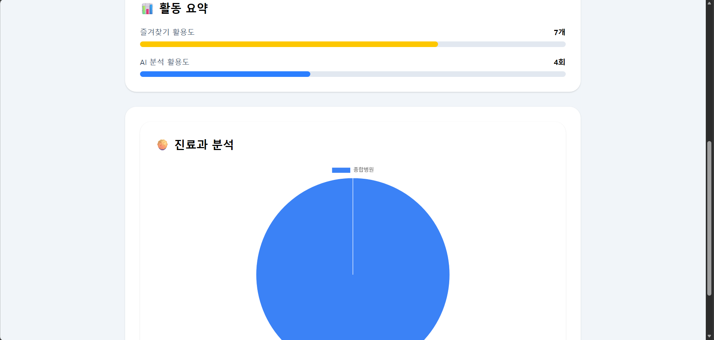 | 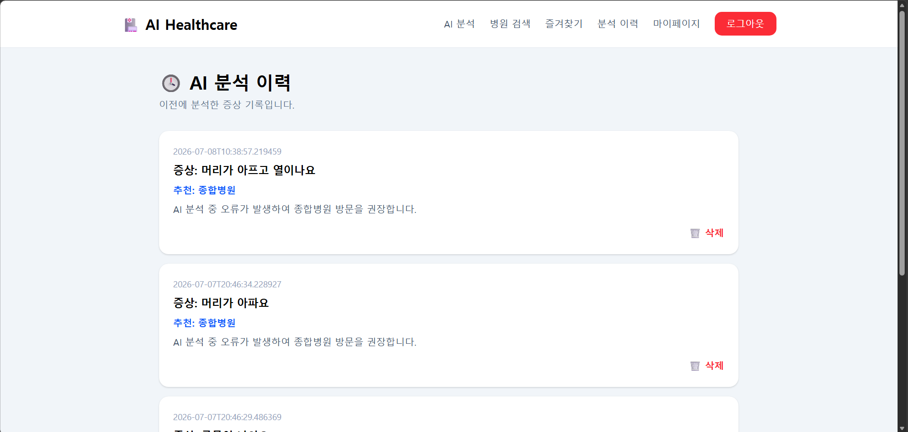 |

---

# 🚨 문제 해결 과정

## 1. JWT 인증 로직을 필터로 분리

### 문제

인증이 필요한 API마다 JWT에서 사용자 정보를 추출하는 로직을
직접 작성하면서 컨트롤러와 서비스에 인증 코드가 반복되었습니다.

### 원인

JWT 검증과 사용자 인증 정보 생성을 애플리케이션의 공통 인증
단계에서 처리하지 않고 각 기능에서 개별적으로 처리하고 있었습니다.

### 해결

JWT 생성·검증 기능을 `JwtTokenProvider`로 분리하고,
요청마다 토큰을 확인하는 JWT 인증 필터를 구현했습니다.

검증에 성공한 사용자 정보는 `SecurityContext`에 저장하여
컨트롤러가 토큰을 직접 해석하지 않도록 변경했습니다.

### 결과

- 컨트롤러의 JWT 처리 코드 제거
- 인증 방식 일원화
- 인증이 필요한 API의 접근 제어를 Spring Security 설정으로 관리

## 2. OpenAI 응답 파싱 실패 처리

### 문제

OpenAI 응답에서 예상한 JSON 형식이 아닌 문자열이나 Markdown 코드
블록이 포함되면 JSON 파싱 예외가 발생하고 요청 전체가 500 오류로
종료됐습니다.

### 원인

AI 응답이 항상 지정한 JSON 구조로 반환될 것이라고 가정하고
응답 내용을 바로 역직렬화했습니다.

### 해결

응답 본문이 비어 있는지 먼저 검증하고, JSON 코드 블록이 포함된
경우 불필요한 문자열을 제거한 후 DTO로 변환하도록 수정했습니다.

파싱에 실패할 경우 공통 예외 처리기를 통해 정해진 오류 코드와
메시지를 반환하도록 구성했습니다.

### 결과

- 비정상 응답에 대한 예외 처리 가능
- 클라이언트에 일관된 오류 응답 제공
- AI 응답 형식 문제와 서버 내부 오류 구분

## 3. HIRA 병원 데이터 중복 저장 방지

### 문제

HIRA 데이터 동기화 API를 반복 호출하면 동일한 병원 정보가
DB에 중복 저장될 가능성이 있었습니다.

### 원인

외부 API에서 받은 병원 데이터를 별도의 식별값 검증 없이
저장하고 있었습니다.

### 해결

HIRA가 제공하는 병원 고유 식별값인 `ykiho`를 기준으로
기존 데이터 존재 여부를 확인한 후 신규 병원만 저장하도록
구현했습니다.

### 결과

- 동기화 API 재호출 시 중복 데이터 생성 방지
- 즐겨찾기와 병원 상세 조회에서 동일한 병원 식별값 사용
- 외부 데이터와 내부 데이터의 연결 기준 확립

---
# 🚀 배포 과정

### 1. Docker 이미지 생성

```bash
docker build -t sangwo0/ai-healthcare-backend:latest .
```

### 2. Docker Hub 업로드

```bash
docker push sangwo0/ai-healthcare-backend:latest
```

### 3. AWS EC2

```bash
ssh -i ai-healthcare.pem ubuntu@EC2
```

### 4. Docker Compose

```bash
docker compose pull
docker compose up -d
```

### 5. 결과

- Docker Compose 기반으로 Spring Boot와 MySQL 컨테이너 구성
- Docker Hub 활용하여 이미지를 배포하고 EC2에서 Pull 방식으로 실행하도록 구성
- Docker Compose로 Spring Boot와 MySQL 컨테이너 환경을 구성하고, Docker Hub에 이미지를 등록한 후 AWS EC2에서 배포 과정을 진행

---

# 🚀 향후 개선 사항

- GitHub Actions CI/CD
- HIRA 진료과목 API 연동
- 지도(Map API) 연동
- 위치 기반 병원 추천
- 검색 자동완성

---

# 📚 프로젝트를 통해 배운 점

- Spring Boot 기반 REST API 설계 및 구현 경험
- Spring Security와 JWT 인증 구조 이해
- OpenAI API 및 HIRA Open API 연동 경험
- JPA 기반 데이터베이스 설계 및 CRUD 구현
- Docker Compose를 활용한 컨테이너 환경 구축
- Docker Hub와 AWS EC2를 활용한 서비스 배포 경험
- 운영 환경에서 발생하는 문제를 로그 분석을 통해 해결하는 경험

# 👨‍💻 Developer

## 조상우

- Backend : Spring Boot
- Frontend : React
- Database : MySQL

---
